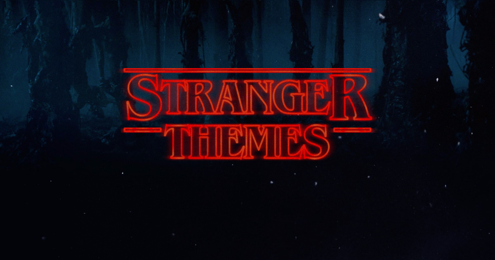

# Stranger Themes

The theming system in WordPress dates [back to 2005](https://wordpress.org/news/2005/02/strayhorn/). A lot has changed on the web, and in WordPress, since then.

What would we build for WordPress theming and customizing today? Stranger Themes is our answer.



## Why?

WordPress is frustrating for many users who just want to make their website look the way they want.

The proliferation of drag-and-drop/wysiwyg/page-builder products for WP and its competition speaks to a basic desire: to have direct control of the website layout and appearance.

The WP Theme Customizer can't do this, because WP themes weren't built to be customized. Actually, they *were* built to be customized: by editing your PHP template files. Even though WP is open source software made by people who love technology, most of our users would love to never see anything that looks like code, ever again. They want control. They want to edit what they see, where they see it. And maybe that's also a democratization of publishing.

## What's in a name?

That which we call a theme by any other name would look as sweet.

Let's redefine what makes up a theme by allowing each page to have its own layout and content, building it up from a library of components and templates. These pages would still benefit from the WordPress template hierarchy, but would also allow creating a website in a more natural and customizable manner, right down to the layout of a blog post.

## Usage

There are two pieces to this project. This library will provide a WordPress plugin that will allow rendering a site using a Stranger Theme. The other piece is a site builder app, which will edit the theme.

You can read all about the pieces of a theme config in the [theme directory](./src/themes/README.md).

To render a theme config as a React component, use the `ThemePreview` component:

```javascript
import { ThemePreview } from 'stranger-themes';

const themeConfig = {
	"name": "MyTheme",
	"slug": "mytheme",
	"pages": {
		"home": { "id": "siteLayout", "componentType": "ColumnComponent", "children": [
			{ "id": "helloWorld", "componentType": "TextWidget", "props": { "text": "hello world" } }
		] }
	}
};

const App = () => (
	<div>
		<ThemePreview themeConfig={ themeConfig } >
	</div>
);
```
